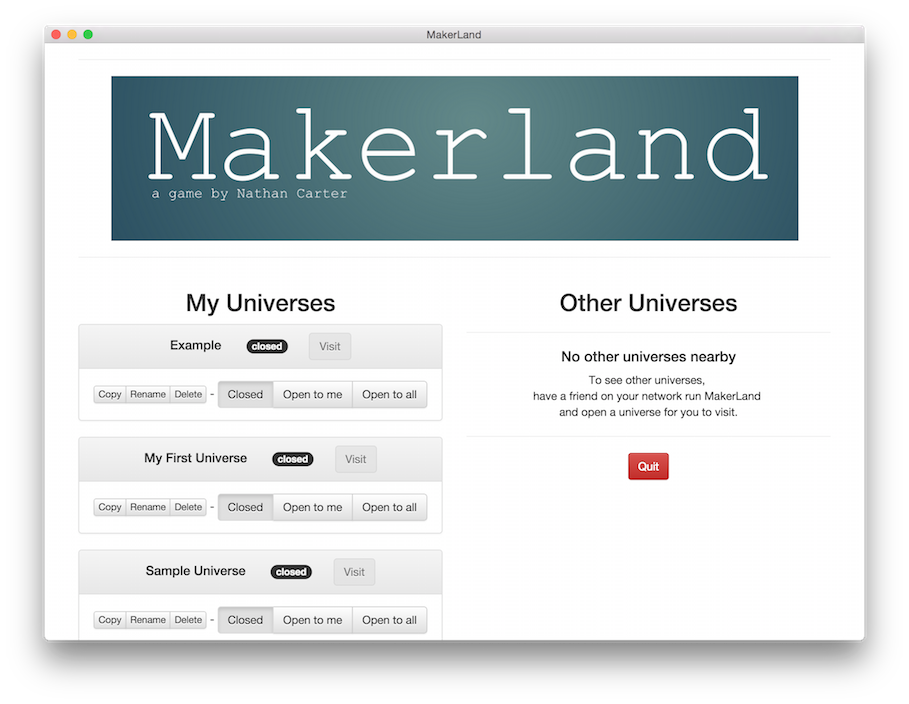
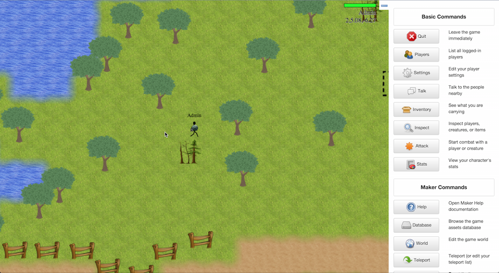

# MakerLand

I built this app as a venue for creating games to play with my kids, and to
begin to teach them JavaScript.  It's a work in progress, but it's time to
share it with more than just my family.

## What is MakerLand?

It's an app in which you create multi-player games in a simple, tile-based
map.  It comes with only one tiny sample "universe," but lets you create as
much as you can imagine in as many universes as you like.  Add your own art,
sounds, behaviors, and even new code to the game itself, all from within the
game's interface.  Then open your universe to your friends.

## Where can I learn more?

There's lots of in-game documentation, but start here:

 * [Video #1: Introduction](https://youtu.be/tTK8fBjzGPw?list=PLqm1puGPkE8g0QGk71yV6kXu4JcZ0J2EH)
 * [Video #2: Your New Universe](https://www.youtube.com/watch?v=v6QgkKVhXJU&list=PLqm1puGPkE8g0QGk71yV6kXu4JcZ0J2EH&index=2)
 * [Video #3: The Database](https://www.youtube.com/watch?v=LKm5C-Nd-eM&index=3&list=PLqm1puGPkE8g0QGk71yV6kXu4JcZ0J2EH)
 * [Video #4: Changing the World](https://www.youtube.com/watch?v=2n22ICEV95o&index=4&list=PLqm1puGPkE8g0QGk71yV6kXu4JcZ0J2EH)
 * [Video #5: Making Things Behave](https://www.youtube.com/watch?v=V-JnSrA8eKY&index=5&list=PLqm1puGPkE8g0QGk71yV6kXu4JcZ0J2EH)
 * [Video #6: Creating New Behaviors](https://www.youtube.com/watch?v=MLGBm4hErwQ&list=PLqm1puGPkE8g0QGk71yV6kXu4JcZ0J2EH&index=6)
 * [Video #7: Cutting Loose](https://www.youtube.com/watch?v=dHTn8MVFp2c&index=8&list=PLqm1puGPkE8g0QGk71yV6kXu4JcZ0J2EH)
